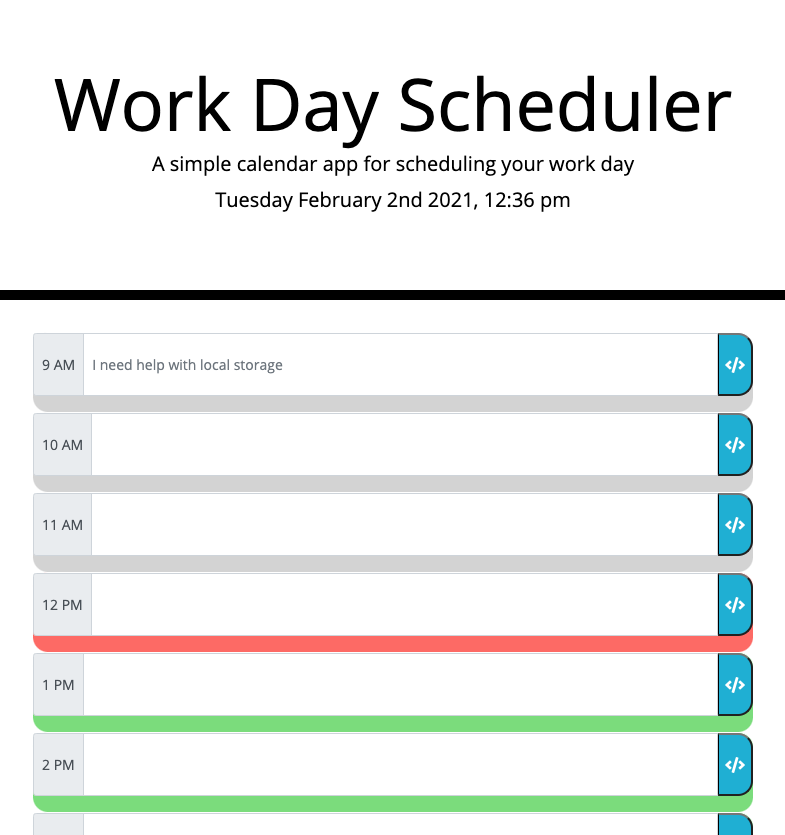

# Work Schedule 
### Homework 5 - David Bushard

 

## What I did.
* For this assinment I needed to create day planner. 
I used HTML, JavaScript, CSS and Moments.Js API. 

 
 

# Critiria for Assignment. 

* The user has a daily planner to create a schedule.
* They open the planner, the current day is displayed at the top of the calendar.
* Scroll down, the user is presented with time blocks for standard business hours.
* The time blocks for that day is color-coded to indicate whether it is in the past, present, or future.
* I can enter and event and save that event even if you refresh the page. (Pending)

 

Links to Repo and Live Page:

### https://github.com/DavidBuoy/work-day-scheduler

### https://davidbuoy.github.io/work-day-scheduler/

 
 

# Screenshots & Gif

 
 

